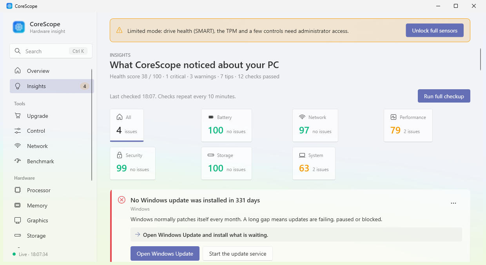
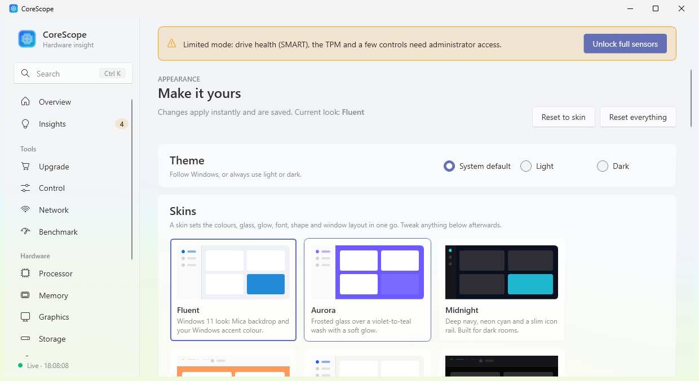
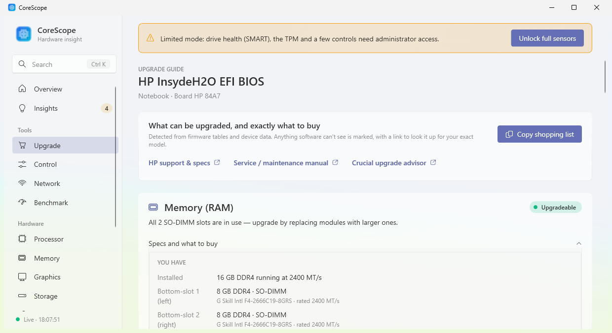

# CoreScope

**See every part of your Windows PC, watch it live, and find out exactly what you can upgrade.**

CoreScope is a free hardware-information and monitoring app for Windows 10 and 11, in the spirit of CPU-Z and HWiNFO
but written for normal people: everything is explained in plain English.

## Download

**[⬇ Download the latest version](../../releases/latest)**: get `CoreScope-x.y.z-Setup.exe` from the newest release and run it.

A winget package (`winget install Rakin.CoreScope`) is waiting for review by the winget team and will work once it is approved.

> **"Windows protected your PC"?** CoreScope isn't code-signed yet (signing certificates cost money or need a company).
> Click **More info → Run anyway**. It's shown only once.

## Screenshots

| Insights, with fixes | Appearance | Upgrade guide |
| --- | --- | --- |
|  |  |  |

## What it does

- **Specs:** processor (codename, cores, caches), memory (part numbers, speed, **CAS latency and timings**,
  soldered vs. slots), graphics, storage (health, life left, PCIe speed), motherboard, BIOS, TPM and every device.
- **Live sensors:** load, clocks, temperatures, fans and power, with graphs, an always-on-top overlay and CSV recording.
- **Insights:** dozens of plain-English health checks (hardware, security, Windows support and update status, recovery,
  maintenance, startup load, display). Each shows the measurement and rule behind it, and what passed. Serious findings
  come with buttons that **fix it for you** (after asking), **open the exact Windows settings page**, **jump to the right
  section of CoreScope**, or **walk you through BIOS/UEFI changes** step by step.
- **Upgrade guide:** what's soldered, free RAM and M.2 slots, maximum capacity, what to buy, plus a shopping list.
- **Benchmark:** CPU, memory and disk, with your history.
- **Control center:** resolution and refresh rate, brightness, power mode, battery conservation, Wi-Fi and Bluetooth,
  fans, devices and startup apps. Every change can be undone for 15 seconds.
- **Appearance:** light, dark or system theme; six skins (Fluent, Aurora, Midnight, Ember, Paper, Terminal) that change
  colours, glass, glow, font, shape and window layout; sidebar, compact-rail or top-tab layouts; your own accent colour,
  transparency, glow and font; saved themes you can export and import; a different look or accent for any page.
- **Select and copy any text:** drag to select, or right-click to copy a text or everything on the page.
- Tray icon, temperature and battery alerts, and HTML report export.

CoreScope starts as a normal app. Click **Unlock full sensors** to restart it with administrator rights. This adds CPU
temperature, fan control, drive health and the remaining controls.

## Requirements

64-bit Windows 10 version 2004 or later, or Windows 11. Intel or AMD. Nothing else to install.
CoreScope installs no drivers: CPU load, clock and temperature come from Windows itself.

## Privacy

Everything stays on your PC. There is no account and no telemetry. The only network use is what you ask for: the optional
update check (asks GitHub for the newest release; nothing about your PC is sent, and you can turn it off in Settings) and the
speed test on the Network page.

## Problems?

Open an [issue](../../issues). To help diagnose a PC, run `CoreScope.exe --selftest` from the install folder
(`%LocalAppData%\Programs\CoreScope`). Attach the `selftest.json` and `corescope.log` files it writes.
It never changes any settings.

## For developers

Build, project layout and how to add checks are in [docs/DEVELOPMENT.md](docs/DEVELOPMENT.md). Release notes are in
[CHANGELOG.md](CHANGELOG.md).

```
dotnet test tests/CoreScope.Tests     # unit tests
tools\package.ps1                     # self-contained zip and one-click installer (needs the .NET 10 SDK and Inno Setup 6)
```
